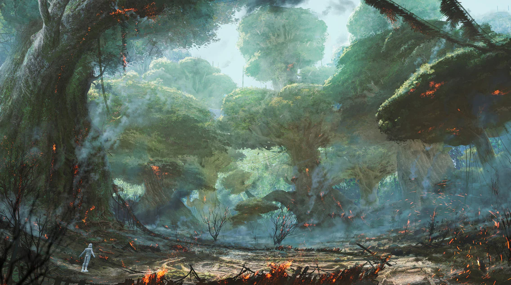
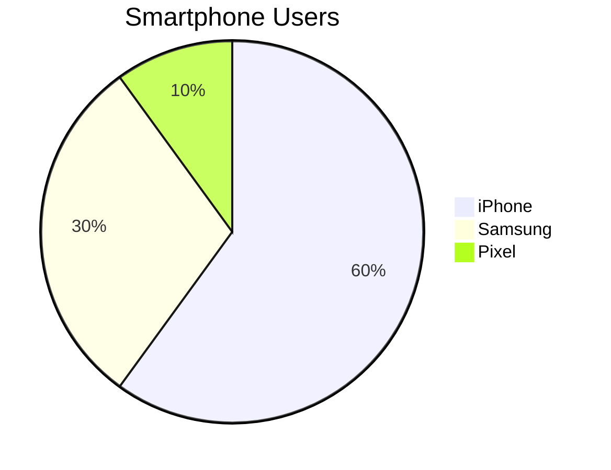

Table of contents
* [Headings](#headings)
* [Plaintext](#plaintext)
* [Text Styling](#text-styling)
* [Quotes](#quotes)
* [Lists](#lists)
* [Line Breaks](#line-breaks)
* [Images](#images)
* [Links](#links)
* [Code](#code)
* [Task Lists](#task-lists)
* [Tables](#tables)
* [Pie Charts](#pie-charts)

## Headings:

# Big heading (h1)

## Medium heading (h2)

### Small heading (h3)

#### h4

##### h5

###### h6

## Plaintext
This is plaintext

## Text Styling
*This is italics*

_This is italics too_

**This is bold**

__This is bold too__

*This is a mix of **BOLD** and **ITALICS!***

## Quotes
> This is a quote
>> this can be who said it
 
## Lists
* Item a
  * Sub-item x
* Item b

- Hi

Don't use numbered unless order is important
1. Item 1
7567. Item 2
3. Item 3 
4. Item 4

## Line Breaks
<br>

## Images


## Links
[Link](https://www.spartaglobal.com)

## Code
This is code: `print('hello')`
This is a code block:
```python
while True:
    print("Hello")
```

## Task lists
* [ ] Incomplete task
* [x] Complete task

## Tables
| Name  | Street       | Town        |
|-------|--------------|-------------|
| Cathy | Main St      | Birmingham  |
|  John | Maple Drive  | Stafford    |

## Pie charts
doesn't work without plugin
